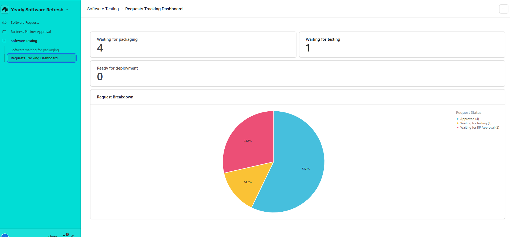

# Summer Refresh - Software Request System

This project is a streamlined replica of a real-world software request and deployment workflow, built using **Airtable** to automate and simplify traditionally messy, spreadsheet-based processes.

---

## 📋 Project Overview

This system was designed to handle:
- Lecturer software installation requests
- Licensing checks
- Deployment scheduling
- Testing and feedback collection

The aim was to **eliminate manual coordination**, **increase transparency**, and **accelerate** software deployment cycles.

---

## 🧱 Data Structure

The Airtable database consists of four interconnected tables:
- **Requests**: Lecturer software requests, driving the workflow.
- **Business Partners**: Licensing contacts for approval flows.
- **Testing Machines**: Devices available for software testing.
- **Default Software List**: Software already installed by default for user visibility.

**Entity Relationship Diagram**

---

## 🤖 Key Automations

Five Airtable automations were created:
1. Acknowledgement email sent after form submission.
2. Licence verification emails sent automatically if needed.
3. Approval/rejection flow for new licences.
4. Notification when software is ready for testing.
5. Feedback collection with pass/fail triggers to deployment team.

---

## 🎨 Interfaces

Three custom-built Airtable Interfaces:
- **Software Request Interface** (Lecturers): Submit and track software requests.
- **Business Partner Interface**: Approve or reject licence needs.
- **Deployment Team Interface**: Monitor ready-for-packaging and deployment status.

---

## 📈 Future Improvements

- Add permissions-controlled pages.
- Enhance interface styling and helper text.
- Expand dashboard summaries for better tracking.
- Refine data validation to improve submission quality.

---

## Interfaces:

**Software Request Form:**
*For users to submit new software requests.*

**Software Awaiting Test:**
*Filtered for users to see software they need to test, updating the "Test result value" field moves it through the flow.*

**Default Software List:**
*A simple searchable list for users to check if the software they are requesting will already be installed.*

**Business Partner Licence Approval Screen:**
*For business partners to access any requests that don't have already have a license and approve or deny the request. Filtered for their division.*

**Software Awaiting Packing for Testing:**
*Deployment team's interface to see any software that already has a license/has been approved for a license and set it to be ready for testing*

**Dashboard Tracking Request Status:**
*Dashboard for seeing where all requests are in the process and acknowledge their key metrics: Waiting for packaging (where they need to act), waiting for testing (where users need to act), and ready for deployment (any items that have been successfully tested).*

## Tables:

**Requests Table:**

**Business Partners Table:**

**Test Machines Table:**

## Automation Flow:

**Example of automation**

*For the sake of not adding many more screenshots, here is an example of one of the 5 automations*

Condition 1: Catch approval, if the license is added in retrospect, will update the record to skip BP approval.

Condition 2: If it meets conditions to see a BP and is denied, send an email to the user to let them know it was denied.

Condition 3: If it meets conditions to see a BP and it approved, update request status to approved so it can be packed for testing.

---

## 🧠 Lessons Learned

- Airtable's relational database model allows for clean, scalable structures.
- Early focus on automation saves huge manual effort later.
- Clear user-centric interfaces dramatically improve adoption rates and system longevity.

