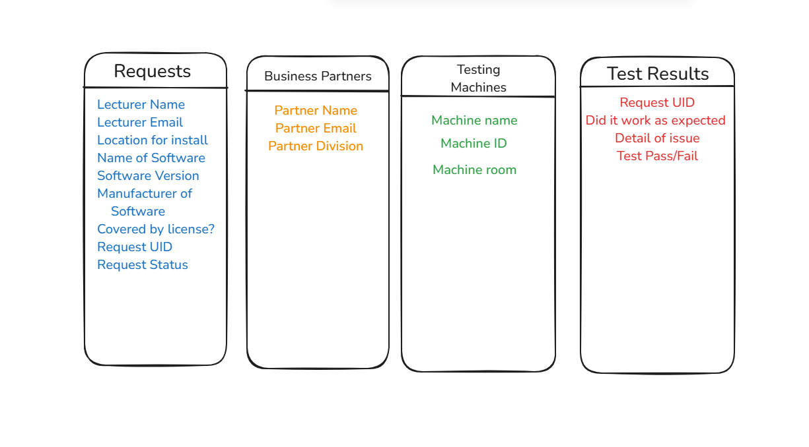

# Summer Refresh - Software Request System

This project is a streamlined replica of a real-world software request and deployment workflow, built using **Airtable** to automate and simplify traditionally messy, spreadsheet-based processes.

---

## 📋 Project Overview

This system was designed to handle:
- Lecturer software installation requests
- Licensing checks
- Deployment scheduling
- Testing and feedback collection

The aim was to **eliminate manual coordination**, **increase transparency**, and **accelerate** software deployment cycles.

---

## 🧱 Data Structure

The Airtable database consists of four interconnected tables:
- **Requests**: Lecturer software requests, driving the workflow.
- **Business Partners**: Licensing contacts for approval flows.
- **Testing Machines**: Devices available for software testing.
- **Default Software List**: Software already installed by default for user visibility.

---

## 🤖 Key Automations

Five Airtable automations were created:
1. Acknowledgement email sent after form submission.
2. Licence verification emails sent automatically if needed.
3. Approval/rejection flow for new licences.
4. Notification when software is ready for testing.
5. Feedback collection with pass/fail triggers to deployment team.

---

## 🎨 Interfaces

Three custom-built Airtable Interfaces:
- **Software Request Interface** (Lecturers): Submit and track software requests.
- **Business Partner Interface**: Approve or reject licence needs.
- **Deployment Team Interface**: Monitor ready-for-packaging and deployment status.

---

## 📈 Future Improvements

- Add permissions-controlled pages.
- Enhance interface styling and helper text.
- Expand dashboard summaries for better tracking.
- Refine data validation to improve submission quality.

---

## 📷 Screenshots

**Interfaces:**

**Requests Table:**

**Deployment Interface:**

**Automation Flow:**

**Data Structure:**

---

## 🧠 Lessons Learned

- Airtable's relational database model allows for clean, scalable structures.
- Early focus on automation saves huge manual effort later.
- Clear user-centric interfaces
